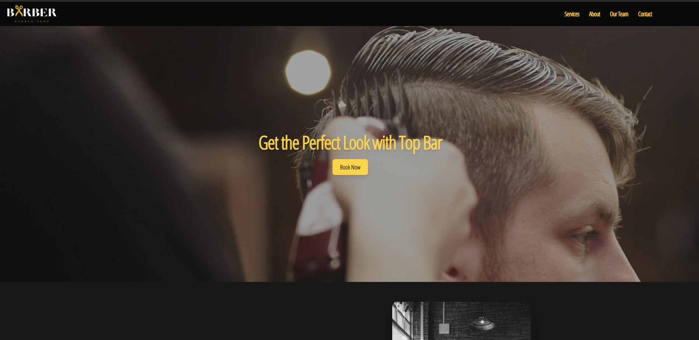

# Barber Booking

A full-featured barber booking application built with **Laravel** (backend) and **React** (frontend). It allows users to browse services, choose barbers, and book appointments. Admins can manage services, barbers, and schedules.

## Features

### Admin Panel
- Add / Delete barbers
- Add / Delete services
### Customer Interface
- Browse available services
- View barbers by selected service
- Choose date & time for booking
- Make reservations easily

## Tech Stack

- **Frontend:** React, Tailwind CSS
- **Backend:** Laravel, MySQL
- **API Authentication:** Laravel Sanctum

  
  
  
  
  

